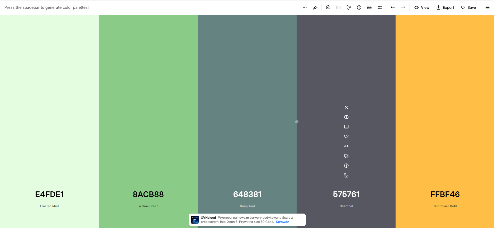

Zamysł aplikacji:
-RWD
-Możliwość zalogowania,
-Są 2 klasy (nauczyciel, uczeń) ew. jeszcze admin z wszystkimi funkcjami ale raczej bez sensu,
-nauczyciel po zalogowaniu może utworzyć test wyświetla mu się modal w którym wypełnia np. Zadanie 1 i daje treść zadania potem Zadanie 2 itd. itd. w późniejszych etapach można dodać zdjęcie można też tak napisać,
-uczeń możne zrobić tak że zostaje przypisany po loginie swoim użytkownika (bądź po mailu? lub ustawionej nazwie użytkownika), dodatkowo może wypełnić egzamin tylko raz chyba że nauczyciel wybierze opcje wielokrotnego podejścia,
-sam modal będzie wyglądać normalnie zadanie1. do wpisania może suwak który pozwoli na jakieś rozszerzenia np. właśnie dodanie zdjęcia,
-proste UI,
-backend node.js
-front react.js
-Jeśli uczeń wyjdzie z testu np. na inny pulpit to nauczycielowi wyświetli się komunikat dokładnie jaki uczeń wyszedł z testu,
-nauczyciel może dodać czas do testu,
-1 strona (główna) będzie wyświetlać możliwość logowania, jakieś zdjęcie w tle i ogólnie logowanie wybór, rejestracji czy logowania i opis aplikacji z lewej storny z prawej logowanie,
-2 po zalogowaniu wyświetla się prosty panel do tworzenia testu (nauczyciel), bądź do dołączenia (uczeń), z lewej strony bądź na górze zrobi się prostą listę z wyborem,
-3 uczeń dostaje stronę z 2 przyciskami dołąćz do egzaminu i drugi wyjdź lub opuść,
-4 uczeń gdy kliknie dołącz, dołączy do egzaminu i wyświetli mu się egzamin na końcu przycisk submit,

DO POPRAWY -

- CSS pozmieniać bo się mocno powtarzają w wielu stronach !important;
- zamiast alertow pozmieniac na odpowiedni css czyli jak jest blad powiedzmy w logowaniu to zamiast alertu bedzie sie wyswietlal odpowiedni css z dymkiem
- Zedytować darkmode/lightmode tak żeby działał porządnie,
- skonfigurować wyniki uczniów, oraz dodać wykresy dla nauczyciela żeby widzał jaka klasa najlepiej poradziła sobie z testem,
- zamienic testową podstrone w jakąś sensowną w panelu studenta,
- po stronie nauczyciela w zarządzaniu klasami, nauczyciel będzie mógł utworzyć klasę i dodać tam ucznia po jego nazwie użytkownika, bądź mailowo(chyba lepiej),
-
